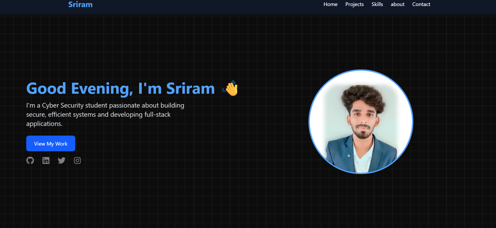

# Portfolio v2 🚀

A modern, animated portfolio built with React + Vite, showcasing projects loaded from a backend API. Smooth interactions, dynamic project cards, and live counters for likes and views. 💫

## 🔗 Live Demo

- Visit the site: https://project-obs-v2.netlify.app/
- [Visit my API](https://project-management-mdb.onrender.com)
- [Dashboard](https://project-management-mdb.onrender.com/admin-dashboard)

- only access by admin https://project-management-mdb.onrender.com/admin-login

## 🖼️ Screenshot




## ✨ Features

- **Dynamic Projects** fetched from API
- **Like & View Counters** with cooldown handling ⏳
- **View Tracking** on code/live clicks and likes 👀
- **Load More** pagination for projects ➕
- **Responsive UI** with motion effects and glassmorphism 🎨
- **Date Formatting** (dd/mm/yyyy) for project dates 📅

## 🛠️ Tech Stack

- React + Vite ⚡
- Tailwind CSS 💎
- Framer Motion 🎞️
- Axios 🌐

## ▶️ Run Locally

```bash
git clone https://github.com/heyshreee/portfolio-v2.git
cd portfolio-v2
npm install
npm run dev
```

## 🌐 Environment

- API base: `https://project-management-mdb.onrender.com/api/v1/projects`
- Live site: `https://project-obs-v2.netlify.app/`

---

Made with ❤️ by Sriram
